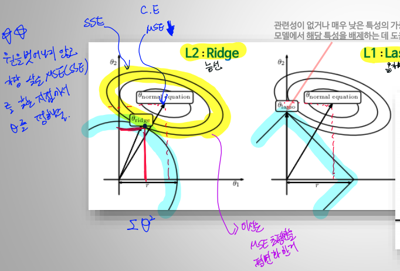

## 목차
- [AI 개요](#ai개요)
- [ML vs DL](#ml-vs-dl)
- [Machine_Learning](#machine-learning)
    - [Machine Learning 핵심개념](#machine-learning-핵심개념)
        - Overfitting and Generalization
        - Gradient Descent Algorithm
        - 종류
- [Deep Learning](#deep-learning)
    - [Deep Learning 핵심개념](#deep-learning-핵심개념)
        - Activation Function
        - 모델 구분
    - [Deep Learning Model 최적화 개념](#deep-learning-model-최적화-개념)
        - Neural Network Optimization
            - Weight Initialization
            - Weight Regularization
            - Advanced gradient descent algorithms(HP 관련 내용들)
        - Avoid Overfitting
            - Drop out
            - Batch Normalization

## AI개요

- AI란? @@데이터를 통해, @@모델을 만들고, @@기능을 만든다
  - 모델 : 데이터에 대한 설명 방법
  - 종류 :
    > Artificial (????) Intellgince  
    > ANI (Narrow) : 약한 AI, 특정분야에서만  
    > AGI (General) : 강한 AI, 인간 만큼의 지능  
    > ASI (super) : 인간을 뛰어 넘는 지능.
  - 중요 키워드 : Auto ML
  - 데이터 종류 : 정형 / 반정형(log, Sensor, )/ 비정형(이미지, 비디오, 사운드, Document)
    - **그래봤자, 결국 정형데이터 처리 기법으로 처리한다.**

## ML vs DL
 

- ML : 사람이 Feautre를 선정하고, Engineering을 한 데이터로 학습을 진행한다.
- DL : Input Data에 대한 Feature Extraction과 분석과정이 모델(NN)안에서 진행된다.
- *즉, 데이터 input에서의 가공 여부가 가장 큰 차이점*

- c.f) 직무에 대한 소개
    - Data Engineer 
        - Data Pipeline을 구축하는 업무
        - 바로 분석을 할 수 있게 데이터를 전달해주는 역할
    - Business Analyst(Data Analyst)
        - 산업공학 기반
        - 모델링보다는 시각화를 통해 의사결정을 돕는 업무
        - 태블로, POWER BI
    - Machine Learning Researcher(Data Scientist)
        - 연구가 메인
        - 이론과 응용측면으로 나뉨
        - 학력을 굉장히 많이 따짐
- c.f) 공부 소스
[머신러닝 단기집중과정(15hr)](https://developers.google.com/machine-learning/crash-course/ml-intro)
[일주일에 논문 한개씩(PR12)](https://www.youtube.com/watch?v=auKdde7Anr8&list=PLlMkM4tgfjnJhhd4wn5aj8fVTYJwIpWkS)

## Machine Learning

### Machine Learning 핵심개념

- 정의 : 어떠한 과제 **T**ask는, **P**erformance measure 평가받고, **E**xperience를 통해 학습하는 프로그램.
- 분류

  - Supervised Learning : 정답을 예측. classification, regression
  - Un-supervised Learning : 규칙성 찾기
  - Reinforcement Learning : 1)**상태**와 2)**행동** 사이의 상호작용을 통해, 3)환경으로부터 받는 **보상**을 최대화 하기 위한 4) **행동정책**을 찾는 알고리즘

- Data Split @ sklearn.model_selection.train_test_split
  - Train data : Learning 목적
  - Validation data : Hyper Params tuning, **Model Select** 목적
  - Test data : Evaluate 목적

- Overfitting and Generalization
    - Capacity 극대화 (즉, Feature;차원이 너무 큰 경우)
    - ➡ Overfitting 발생
    - ➡ Generalization Error 증가 (즉, test loss 커짐)
    - ➡ New data에 대한 대응력 부족
    - ➡ 대응 방법 : Data 추가확보, Regularization(L1, L2), Drop-out & Batch Normalizaion; BN (딥러닝에서.), HPO, C.V.
        - Cross Validation (교차검증)
            - (Stratified;층화적) K-Fold CV
                    - Test Data를 일정 비율 떼고,
                    - Train + Validation Data를 K등분
                    - 한번씩 돌아가면서 K phase만큼 학습하고, (**Phase마다 모델을 초기화됨.**)
                - K 번을 반복하고 평균값을 사용
                - 목적은, **평가**시에 Train Data에 Overfitting되는것을 방지하는게 첫번째, Hyper Parameter Tuning이 두번째
- Gradient Descent Algorithm (경사하강법)
    - **cost fn vs loss fn vs objective fn????**
    - Cost Function : 가장 적합한 Parameter $\theta$ 를 찾기위해,  $\hat{y}$ 와, $y$의 차이를 기반으로 모델 성능 지표를 찾는걸 도와주는 함수
    - cost func의 Gradient(기울기)를 기반으로 어느방향으로 이동하면 cost값을 최소화할 수 있는지 찾아가는 방식
    > 의문? 미분계수 0인걸 비교하면 되지 않나?  
    > 컴퓨터가 미분계수를 구하는 계산하는것이 어렵고, 비선형함수나, 다중회귀식이나, 아예 닫힌상태가 아닌경우에는 너무 빡셈
    - MSE : 평가지표, 대표적인 Cost Function
      - ${x_i}$ : i번째, 관측치. $\hat{x_i}$ : i 번째 예측치(회귀를 통한 예측)
      - ${x_i}$-$\hat{x_i}$ = $error_{i}$
      - $\frac{\sum_{i = 1}^{...} error_{i}^{2}}{n}$ : MSE
      - 해당 Cost Function의 최소화를 시키는 Parmeter ${\theta}$를 찾는것.

- 종류
    - Supervised Learning (지도학습)
    - Unsupervised Learning (비지도학습)
    - Reinforcement Learning (강화학습)
    
    

## Deep Learning

### Deep Learning 핵심개념
- 목차
    - Activation Function
    - 모델 구분

- Activation Function
    - 정의 : 이전레이어의 가중합을 받아 출력값을 생성해, 다음 레이어로 전달하는 **비선형 함수**
    - 왜 쓰는가? weight와 sum을 통한 NN 모델은 결국 **선형결합(Linear combination)**
    - 그럼, 결국 비선형의 패턴을 가진 데이터에대해서는 설명이 불가능함
    - 따라서, 비선형 함수인 Activation Function을 통과시켜서 데이터에 대한 이해도를 높이는거
- 모델의 구분
    - MLP, SLP (Mulit/Single Layer Perceptron)
        - SLP : AND, OR에 대한 설명만 가능. XOR에 대한 설명이 불가능
        - MLP : XOR(두 데이터의 값이 동일하면 0, 같지않으면 1을 뱉어내는 판별)의 설명을 위해 나타남.
    - ANN
        - Forward Propagation (Feedforward NN) : costfunction의 cost를 낮추도록 Gradient Descent를 적용하여, 원하는 결과를 얻어내기위한 적절한 $\theta$ 를 구하는 방식
            - Layer의 복잡도가 커질수록, 연산이 너무 복잡해짐!
            - 과거데이터(input 단에 가까운애들)에 대한 기억이 상실될 가능성 큼.
        - Back Propagation : Forward 학습을 한번 하고, **error**(학습된 출력값 - 실제값)를 계산하여 역방향으로 전파하는 알고리즘
            - 틀린 정도(error)의 gradient(기울기)값을 역으로 계산해나가면서, G.D를 적용하고 적절한 $\theta$ 를 갱신하게함
                - Gradient Vanishing / Gradient Explode
        - http://playground.tensorflow.org/

### Deep Learning Model 최적화 개념

- Neural Network Optimization
    - Weight Initialization
        - Perceptron의 선형결합(Linear Combination)의 결과값이 너무 커지거나 작아지지 않게 초기값을 설정
        Gradient/Exploding Vanishing을 줄일 수 있음
        - 종류
            - Xavier Initialization (자비에/세이비어/이그제비어 초기화)
                - Activation function이 sigmoid나 tanh일때 적용
                - 딥러닝 라이브러리들의 Default임
                - 표준편차가 $\sqrt{\frac{2}{n_{in}+n_{out}}}$ 인 정규분포를 따르게 가중치 초기화
                    > $n_{in}$ : 이전 layer의 퍼셉트론 수  
                    > $n_{out}$ : 현재 layer의 퍼셉트론 수
                - ReLU함수에서 사용 시 출력 값이 0으로 수렴하게 되는 현상 발생

            - He Initialzation (헤/흐어 초기화)
                - Activation function이 ReLU함수일때 적용
                - 표준편차가 $\sqrt{\frac{2}{n_{in}}}$ 인 정규분포를 따르게 가중치 초기화 

    - Weight Regularization
        - Train data만 고려된 Cost Function으로 Gradient Descent를 하면 Overfitting 위험도가 큼
        - 해서, $\theta$ 에 대한, 함수를 추가함
        
        - 간단한 예로는,아래 예시로 표현할 수 있음
        $$ J(\theta)= MSE+ \lambda*R(\theta) $$
        $*\lambda$ : 정규화율(Regularization Rate)
        - 모델 복합도↑ → overfitting → MSE↓ → Regularization Term ↑
        - 위 Trade-off 속에서 최적값을 찾아냄
        - L1, L2

        

        - 아래 그림처럼, $\theta$의 변화를 통해서, 가장 낮은 MSE를 찾는(그림상에서 접점을 찾는) 방식으로 parameter가 결정됨
    
        - $*\lambda$ (Regularization Rate) : 스칼라값으로, 정규화 함수의 상대적 중요도
        
    - Advanced gradient descent algorithms
        - 세미나내용 참고(https://github.com/tkasod2/TIL/blob/main/Theory/Seminar.md)
        - learning rate
        - Batch Size
        - Optimizaer
        

- Avoid Overfitting
    - Drop out
        - 일부 Perceptron을 꺼서, 편향을 막아줌
        - 앙상블 효과가 있음
    - [Batch normalization](https://github.com/tkasod2/TIL/blob/main/Theory/Seminar.md)
        - scale에 의해 특정 params에 집중되는걸 막아주는 효과
        - 최적 cost value로 접근하는데 꼭 필요함
        - 일반적으로 activation function 진행전에 batch normalization을 진행하는데 이에대해서는 아직 정설은 없음(실험중)
        - 장점 : **학습속도**& 학습 시간 개선, 초기값에 영향 적음, overfitting이 잘 일어나지않음

