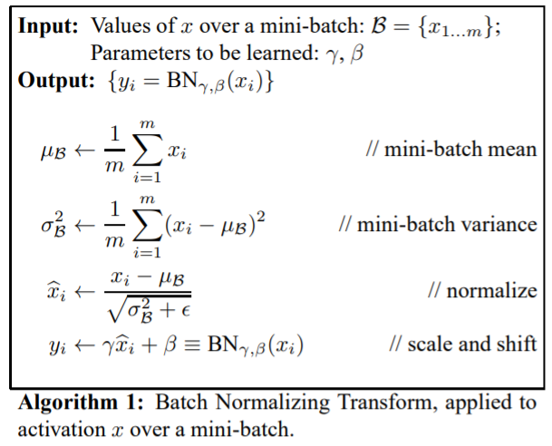

## 딥러닝에서의 Hyper Parameter에 대하여

- Batch Normalization ; BN
    

    
출처
  

    출처1(Batch Normalizaion) : https://arxiv.org/pdf/1502.03167.pdf
    출처2(Batch 정규화) : https://eehoeskrap.tistory.com/430
    

    - BN 배경
        - Gradient Exploding / Vanishing : param's의 변화에 따른 output 변화를 기반으로 학습하는 신경망에서, 해당 이슈로 인해 Error가 큰상태로 수렴하게됨.
        - 특히, Sigmoid, Tanh 등의 활성화 함수에서 출력값의 범위가 굉장히 좁아지는데, (sigmoid 경우 [0,1]) Hidden Layer 중에 이러한 비선형성 레이어가 섞어들어가게되면 결국 학습이 제대로 되지 않게됨.
        - 이에 대응하는 **직접적인 방법으로써 BN이 출현하게됨**
    - 왜 BN?
        - Whitening (= Standard Generalization)의 한계
            - covariance matrix 계산, inverse matrix 계산이 너무 많음
            - bias의 영향력이 사라지게됨
            - Backpropagation이 무시되고 특정 파라미터만 무지 커지게됨
        - 학습 시 평균과 분산의 조정 과정이 신경망 안에 포함
        
        - Gradient Vanishing과 Exploding의 원인은 scale 문제.
            - BN 사용하면 이에 대한 영향이 극도로 작아짐
            - BN 사용하면 Regularization 효과가 있기에 dropout 안써도 됨
            

- Batch Size 
    

    
출처
  

    출처1(컴퓨터 비전 관점 Batchsize) : https://deep-learning-study.tistory.com/647
    출처2(러닝레이트& 배치사이즈) : https://honeyjamtech.tistory.com/43
    출처3(러닝레이트& 배치사이즈) : https://inhovation97.tistory.com/32
    

    - 크면? Noise 감소(Batch 로 부터 Normalization을 하기때문), 학습속도 빠름 , Overfitting 위험
    - 작으면? Noise 증가, regularization 효과, step이 길어짐. local minima로 빠질 위험
    - 그러면 어쩌라고...?ㅠㅠ
        - 32~ 128 추천. [Rethinking "Batch" in BatchNorm](https://arxiv.org/pdf/2105.07576.pdf) 2021. Facebook AI Research. Yuxin Wu, Justin Johnson
            > [page6, 4-1 발췌] In this experiment, the best validation error is found at a normalization batch size of 32∼128, where the amount of noise and inconsistency provides balanced regularization.
        - 32 이상하면 말리라는 ...;;
        
    - **결국 Learning Rate와 조절이 같이 되어야함.**

- Learning Rate
    

    
출처
  

    출처1(PyTorch가 제공하는 Learning rate scheduler 정리) : https://sanghyu.tistory.com/113
    

    
    - 크면? Overshooting 현상으로 loss 발산의 위험
    - 작으면? Local Minima에 빠질 위험
    - 그러면? Learning Rate를 점차 줄여서 학습시키는 기법 활용
    - 단, 첫 lr에 대한 완벽한 방법은 없을듯.
        - LambdaLR 활용 epoch마다 곱해주는 방식
        - 추가로 StepLR, MultiStepLR, ExponentialLR, ReduceLROnPlateau 등이 있음.
        > ### pytorch code 예시(1)
        > optimizer = torch.optim.SGD(model.parameters(), lr=0.001)
        > scheduler = optim.lr_scheduler.LambdaLR(optimizer=optimizer,
                                lr_lambda=lambda epoch: 0.95 ** epoch)
        
        > ### pytorch code 예시(2)
        > lr_scheduler = torch.optim.lr_scheduler.ExponentialLR(optimizer, 0.997)
        > lr_scheduler.step()

        