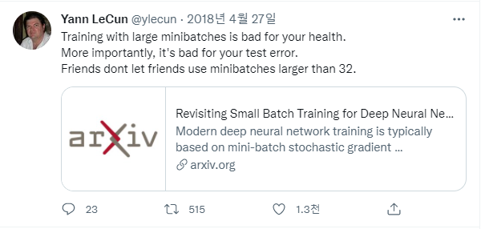

## 딥러닝에서의 Hyper Parameter에 대하여

- Batch Size 
    

    
출처
  

    출처1(컴퓨터 비전 관점 Batchsize) : https://deep-learning-study.tistory.com/647
    출처2(러닝레이트& 배치사이즈) : https://honeyjamtech.tistory.com/43
    출처3(러닝레이트& 배치사이즈) : https://inhovation97.tistory.com/32
    

    - 크면? Noise 감소(Batch 로 부터 Normalization을 하기때문), 학습속도 빠름 , Overfitting 위험
    - 작으면? Noise 증가, regularization 효과, step이 길어짐. local minima로 빠질 위험
    - 그러면 어쩌라고...?ㅠㅠ
        - 32~ 128 추천. [Rethinking "Batch" in BatchNorm](https://arxiv.org/pdf/2105.07576.pdf) 2021. Facebook AI Research. Yuxin Wu, Justin Johnson
            > In this experiment, the best validation error is found at a
normalization batch size of 32∼128, where the amount of
noise and inconsistency provides balanced regularization.
        - 32 이상하면 말리라는 ...;;
        
    - **결국 Learning Rate와 조절이 같이 되어야함.**

